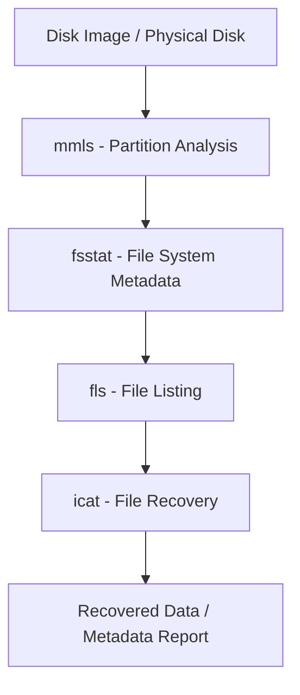

# Analysis-of-the-Disk-Structure-using-Sleuth-Kit
## AIM:
To analyze the disk structure of a given disk image using Sleuth Kit tools in Kali Linux.

## REQUIREMENTS
- **Operating System**: Windows 10/11 or Kali Linux
- **Tools**:  
  - [The Sleuth Kit for Windows](https://sleuthkit.org/)  
  - Optional GUI: [Autopsy Forensic Browser](https://www.autopsy.com/)
- **Test Data**: Disk image file (`disk.dd`, `disk.img`, `.E01`)

## ARCHITECTURE DIAGRAM

## DESIGN STEPS:
### Step 1:
- Obtain or create a disk image file (e.g., disk.dd) to analyze.
- Open the terminal in Kali Linux.

### Step 2:
Use Sleuth Kit tools like:
 - mmls → Examine the partition layout.
 - fsstat → View file system details.
 - fls → Get file listing.
 - icat → Recover files using inode numbers.
### Step 3:
Interpret the output to understand:
 - Partition table layout
 - File system metadata (block size, creation time, etc.)
 - Deleted and allocated files
 - Inode-based file recovery

## PROGRAM:
Sleuth Kit Disk Analysis Commands
### Partition Analysis
```bash
mmls disk.dd
```
### File System Metadata
```bash
fsstat -o 2048 disk.dd
```
### File Listing
```bash
fls -o 2048 disk.dd
```
### File Recovery
```bash
icat -o 2048 disk.dd 4 > recovered_file.txt
```
- Recovers the file associated with inode 4.
## SAMPLE WORKFLOW (Windows)
```bash
# Step 1: View partitions
mmls.exe C:\forensics\disk.dd

# Step 2: View file system details
fsstat.exe -o 2048 C:\forensics\disk.dd

# Step 3: List files
fls.exe -r -o 2048 C:\forensics\disk.dd

# Step 4: Recover a file
icat.exe -o 2048 C:\forensics\disk.dd 6 > C:\forensics\image.jpg
```
## OUTPUT:
Disk Structure Analysis Results


Create Disk


mmls
mmls disk.dd

fls
fls -f fat -o 0 disk.dd


## RESULT:
The analysis was performed successfully using Sleuth Kit, and the disk structure was understood in detail.
